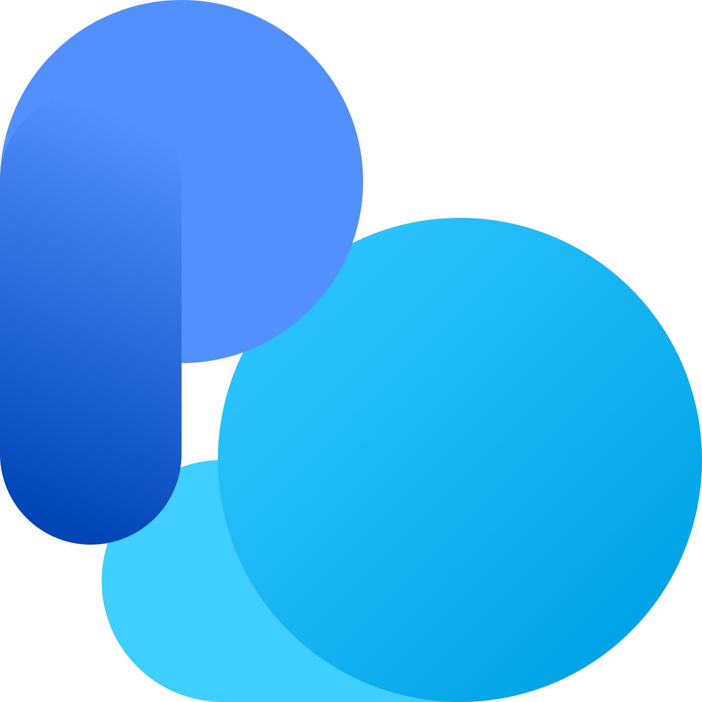
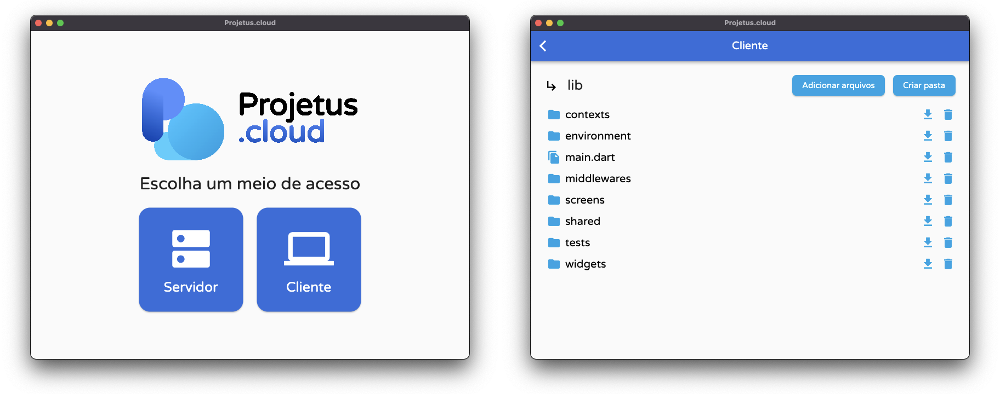

# Sobre la plataforma

Este software es un servicio integrado de [computación en la nube](https://es.wikipedia.org/wiki/Computaci%C3%B3n_en_la_nube), con aplicaciones tanto para hospedaje en un **servidor** (con o sin interfaz gráfica) como para acceso en un **cliente**, de forma dinámica y sincronizada.

Notoriamente, sus principales capacidades son:

- Sincronización de un disco con la red;
- Lista de archivos y directorios del disco;
- Obtención y eliminación de estos archivos y directorios;
- Añadir o crear nuevos archivos y directorios al disco.

<p align="center">
  
</p>

## Requisitos para operación

Para trabajar con este software en su sistema operativo, es necesario instalar el framework [Flutter](https://flutter.dev) en su máquina, el cual también incluye los binarios del lenguaje [Dart](https://dart.dev).

Asegúrese de que estas plataformas estén añadidas a la variable `$PATH` de su shell y que todas las dependencias de Flutter estén configuradas, usando el siguiente comando:

```shell
flutter doctor
```

Además, se recomienda utilizar el entorno de desarrollo [Visual Studio Code](https://code.visualstudio.com), con las extensiones oficiales de Dart y Flutter, para depuración y construcción de la plataforma.

## Configuraciones necesarias

Al acceder por primera vez a la plataforma, se solicitará al usuario el envío de un archivo de configuración en formato [JSON](https://es.wikipedia.org/wiki/JSON), el cual debe guardarse con el nombre **config.pcc** (*Projetus Cloud Configuration File*), y cuyos parámetros deben completarse según el siguiente modelo:

```json
{
  "githubToken": "<Su token de acceso a GitHub para trabajar con Gists>",
  "databaseGistId": "<Su ID de Gist de GitHub que funcionará como base de datos>",
  "databaseName": "<Nombre del archivo Gist de GitHub que almacenará los datos>",
  "ipSecretKey": "<Una clave de criptografía AES con 32 caracteres de longitud>",
  "ipSecretIv": "<Un vector de criptografía AES con 16 caracteres de longitud>",
  "serverToken": "<Una clave de criptografía para controlar las solicitudes al servidor>"
}
```

A este archivo también se puede agregar un campo adicional, `storagePath`, que debe contener la ruta absoluta del disco que se sincronizará con la red si el programa se ejecuta en [modo headless](#modo-headless).

## Compilación y distribución

Para construir el programa en su totalidad, abra la carpeta [app](../app) del código fuente de este proyecto en su terminal e inícielo con la siguiente secuencia de comandos:

```shell
flutter pub get
flutter create . --platforms=linux,macos,windows
```

Además, se recomienda definir el nombre de la aplicación con:

```shell
dart run rename setAppName --targets linux,macos,windows --value "Projetus.cloud"
```

De la misma manera, se sugiere definir los iconos de las aplicaciones con:

```shell
dart run flutter_launcher_icons
```

Teniendo en cuenta todos estos factores, es posible construir la aplicación con este comando:

```shell
flutter build
```

## Avisos específicos

### MacOS

Si está trabajando en macOS, asegúrese de que el acceso a Internet a través de la aplicación esté habilitado en su configuración. Como se describe en [este artículo](https://docs.flutter.dev/platform-integration/macos/building#setting-up-entitlements), puede hacerlo mostrando la carpeta [app/macos](../app/macos) en [.vscode/settings.json](.vscode/settings.json) y editando los siguientes archivos:

- [app/macos/Runner/DebugProfile.entitlements](../app/macos/Runner/DebugProfile.entitlements)
- [app/macos/Runner/Release.entitlements](../app/macos/Runner/Release.entitlements)

en ambos casos, las siguientes directrices deben estar presentes:

```xml
<key>com.apple.security.network.app-sandbox</key>
<true/>
<key>com.apple.security.network.server</key>
<true/>
<key>com.apple.security.network.client</key>
<true/>
<key>com.apple.security.files.user-selected.read-write</key>
<true/>
<key>com.apple.security.files.downloads.read-write</key>
<true/>
<key>com.apple.security.files.pictures.read-write</key>
<true/>
<key>com.apple.security.files.movies.read-write</key>
<true/>
<key>com.apple.security.files.music.read-write</key>
<true/>
```

### Windows

Si deseas crear una configuración completa para Windows, instala la herramienta [Inno Setup](https://jrsoftware.org/isinfo.php) en tu computadora y ejecuta un script siguiendo el siguiente modelo, en el cual simplemente reemplaza la predefinición `ProjectRoot`:

```iss
#define ProjectRoot "<Your project root absolute path>"

#define AppName "Projetus.cloud"
#define AppExeName "app.exe"
#define AppVersion "1.0"

#define AppPublisher "Ruan Carllo Silva"
#define AppURL "https://github.com/ruancarllo"

#define AppAssocName "Projetus Cloud Configuration File"
#define AppAssocExt ".pcc"
#define AppAssocKey StringChange(AppAssocName, " ", "") + AppAssocExt

[Setup]
AppId={{B5FD2B1B-4C90-4FEC-BE2F-31345386C38B}
AppName={#AppName}
AppVersion={#AppVersion}
AppPublisher={#AppPublisher}
AppPublisherURL={#AppURL}
AppSupportURL={#AppURL}
AppUpdatesURL={#AppURL}
DefaultDirName={autopf}\ProjetusCloud
DisableDirPage=yes
ChangesAssociations=yes
DisableProgramGroupPage=yes
LicenseFile={#ProjectRoot}\LICENSE.md
PrivilegesRequired=lowest
OutputDir={#ProjectRoot}
OutputBaseFilename=mysetup
Compression=lzma
SolidCompression=yes
WizardStyle=modern

[Languages]
Name: "english"; MessagesFile: "compiler:Default.isl"
Name: "spanish"; MessagesFile: "compiler:Languages\Spanish.isl"
Name: "brazilianportuguese"; MessagesFile: "compiler:Languages\BrazilianPortuguese.isl"

[Tasks]
Name: "desktopicon"; Description: "{cm:CreateDesktopIcon}"; GroupDescription: "{cm:AdditionalIcons}"; Flags: unchecked

[Files]
Source: "{#ProjectRoot}\app\build\windows\runner\Release\{#AppExeName}"; DestDir: "{app}"; Flags: ignoreversion
Source: "{#ProjectRoot}\app\build\windows\runner\Release\flutter_windows.dll"; DestDir: "{app}"; Flags: ignoreversion
Source: "{#ProjectRoot}\app\build\windows\runner\Release\data\*"; DestDir: "{app}\data"; Flags: ignoreversion recursesubdirs createallsubdirs

[Registry]
Root: HKA; Subkey: "Software\Classes\{#AppAssocExt}\OpenWithProgids"; ValueType: string; ValueName: "{#AppAssocKey}"; ValueData: ""; Flags: uninsdeletevalue
Root: HKA; Subkey: "Software\Classes\{#AppAssocKey}"; ValueType: string; ValueName: ""; ValueData: "{#AppAssocName}"; Flags: uninsdeletekey
Root: HKA; Subkey: "Software\Classes\{#AppAssocKey}\DefaultIcon"; ValueType: string; ValueName: ""; ValueData: "{app}\{#AppExeName},0"
Root: HKA; Subkey: "Software\Classes\{#AppAssocKey}\shell\open\command"; ValueType: string; ValueName: ""; ValueData: """{app}\{#AppExeName}"" ""%1"""
Root: HKA; Subkey: "Software\Classes\Applications\{#AppExeName}\SupportedTypes"; ValueType: string; ValueName: ".myp"; ValueData: ""

[Icons]
Name: "{autoprograms}\{#AppName}"; Filename: "{app}\{#AppExeName}"
Name: "{autodesktop}\{#AppName}"; Filename: "{app}\{#AppExeName}"; Tasks: desktopicon

[Run]
Filename: "{app}\{#AppExeName}"; Description: "{cm:LaunchProgram,{#StringChange(AppName, '&', '&&')}}"; Flags: nowait postinstall skipifsilent
```

## Modo headless

Debido a problemas de compatibilidad con sistemas simples o heredados que no admiten aplicaciones con la interfaz gráfica de Flutter, este software también proporciona un modo headless, basado en [línea de comandos](https://es.wikipedia.org/wiki/Interfaz_de_l%C3%ADnea_de_comandos), específicamente para el caso del **servidor**.

Esta configuración se puede realizar abriendo la carpeta [app](../app) en el código fuente, eliminando todas las dependencias relacionadas con Flutter del archivo [app/pubspec.yaml](../app/pubspec.yaml) y luego ejecutando el comando:

```shell
dart pub get
```

y compilándolo en un ejecutable independiente con:

```shell
dart compile exe lib/tasks/headless.dart -o "projetus-cloud"
```

Para iniciar la ejecución en este modo, coloque el archivo **config.pcc** en la misma carpeta que el binario generado en la compilación y ábralo con dos clics (en sistemas Windows), o con la siguiente secuencia de comandos (en sistemas Unix):

```shell
chmod +x projetus-cloud
./projetus-cloud
```

## Complicaciones de red

La utilización de esta plataforma en la capa del servidor sigue un precepto muy importante: exponer la [IP](https://es.wikipedia.org/wiki/Protocolo_de_Internet) de su computadora a Internet, así como el [puerto](https://es.wikipedia.org/wiki/Puerto_(inform%C3%A1tica)) 3434 (definido como predeterminado), permitiendo conexiones con los protocolos [TCP](https://es.wikipedia.org/wiki/Protocolo_de_Control_de_Transporte) y [UDP](https://es.wikipedia.org/wiki/User_Datagram_Protocol). Esto debe hacerse configurando el enrutador al cual está conectada esta máquina, un proceso que varía según cada proveedor de servicios.

## Presentación de la aplicación

<p align="center">
  
</p>

## Licenciamiento del proyecto

El código fuente de este proyecto está licenciado bajo los términos de la [BSD 3-clause Clear license](../LICENSE.md),