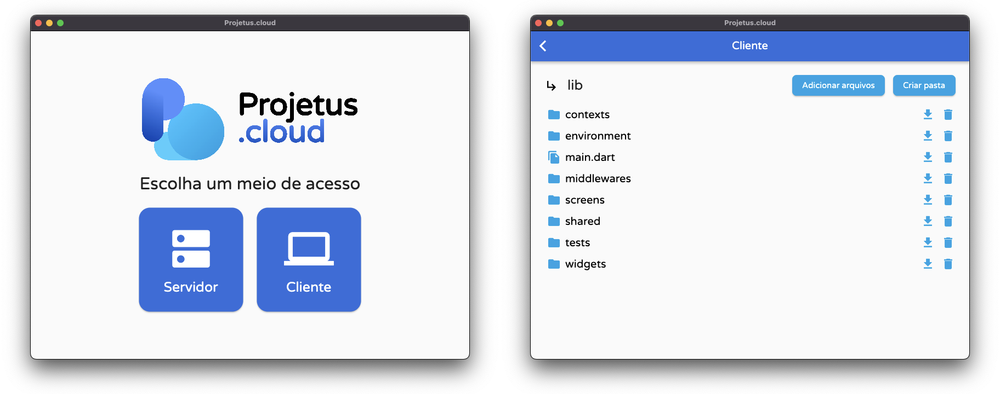

# Sobre a plataforma

Este software é um serviço integrado de [computação em nuvem](https://pt.wikipedia.org/wiki/Computa%C3%A7%C3%A3o_em_nuvem), com aplicações tanto para hospedagem em um **servidor** (com ou sem interface gráfica) quanto para acesso em um **cliente**, de forma dinâmica e sincronizada.

Notavelmente, suas principais capacidades incluem:

- Sincronização de um disco com a rede;
- Lista de arquivos e diretórios no disco;
- Obtenção e remoção desses arquivos e diretórios;
- Adição ou criação de novos arquivos e diretórios no disco.

<p align="center">
  
</p>

## Requisitos de operação

Para trabalhar com este software em seu sistema operacional, é necessário instalar o framework [Flutter](https://flutter.dev) em sua máquina, que inclui também os binários da linguagem [Dart](https://dart.dev).

Certifique-se de que essas plataformas estão adicionadas à sua variável `$PATH` em seu shell e que todas as dependências do Flutter estão configuradas usando o seguinte comando:

```shell
flutter doctor
```

Além disso, é recomendável usar o ambiente de desenvolvimento [Visual Studio Code](https://code.visualstudio.com) com as extensões oficiais do Dart e Flutter para depuração e construção da plataforma.

## Configurações necessárias

Ao acessar a plataforma pela primeira vez, o usuário será solicitado a enviar um arquivo de configuração no formato [JSON](https://pt.wikipedia.org/wiki/JSON), que deve ser salvo com o nome **settings.pcc** (*Arquivo de Configuração do Projetus Cloud*), e cujos parâmetros devem ser preenchidos de acordo com o modelo abaixo:

```json
{
  "githubToken": "<Seu token de acesso ao GitHub para lidar com Gists>",
  "databaseGistId": "<Seu ID do GitHub Gist que funcionará como banco de dados>",
  "databaseName": "<Nome do arquivo do GitHub Gist que armazenará os dados>",
  "ipSecretKey": "<Uma chave de criptografia AES com 32 caracteres de comprimento>",
  "ipSecretIv": "<Um vetor de criptografia AES com 16 caracteres de comprimento>",
  "serverToken": "<Uma chave de criptografia para controlar as solicitações ao servidor>"
}
```

A este arquivo, mais um campo, `storagePath`, pode ser adicionado, o qual deve conter o caminho absoluto do disco que será sincronizado com a rede, se o programa for executado em [modo headless](#modo-headless).

## Compilação e distribuição

Para compilar o programa como um todo, abra a pasta [app](../app) do código-fonte deste projeto em seu terminal e inicie com a seguinte sequência de comandos:

```shell
flutter pub get
flutter create . --platforms=linux,macos,windows
```

Além disso, é recomendável definir o nome da aplicação com o seguinte comando:

```shell
dart run rename setAppName --targets linux,macos,windows --value "Projetus.cloud"
```

Da mesma forma, é recomendável definir os ícones da aplicação com:

```shell
dart run flutter_launcher_icons
```

Levando em consideração todos esses fatores, é possível construir a aplicação com este comando:

```shell
flutter build
```

## Avisos específicos

Se você estiver trabalhando no macOS, certifique-se de que o acesso à internet através do aplicativo esteja habilitado em suas configurações. Conforme descrito neste [artigo](https://docs.flutter.dev/platform-integration/macos/building#setting-up-entitlements), você pode fazer isso exibindo a pasta [app/macos](../app/macos) em [.vscode/settings.json](.vscode/settings.json) e editando os seguintes arquivos:

- [app/macos/Runner/DebugProfile.entitlements](../app/macos/Runner/DebugProfile.entitlements)
- [app/macos/Runner/Release.entitlements](../app/macos/Runner/Release.entitlements)

em ambos os quais as seguintes diretrizes devem estar presentes:

```xml
<key>com.apple.security.network.app-sandbox</key>
<true/>
<key>com.apple.security.network.server</key>
<true/>
<key>com.apple.security.network.client</key>
<true/>
<key>com.apple.security.files.user-selected.read-write</key>
<true/>
<key>com.apple.security.files.downloads.read-write</key>
<true/>
<key>com.apple.security.files.pictures.read-write</key>
<true/>
<key>com.apple.security.files.movies.read-write</key>
<true/>
<key>com.apple.security.files.music.read-write</key>
<true/>
```

## Modo headless

Devido a problemas de compatibilidade com sistemas simples ou legados que não suportam aplicações de interface gráfica do Flutter, este software também fornece um modo headless, baseado na [interface de linha de comando](https://pt.wikipedia.org/wiki/Interface_de_linha_de_comandos), especificamente para o caso do **servidor**.

Este modo pode ser configurado abrindo a pasta [app](../app) do código-fonte em seu terminal com o comando:

```shell
dart pub get
```

e compilado em um executável independente com:

```shell
dart compile exe lib/tasks/headless.dart -o "projetus-cloud"
```

Para iniciar a execução deste modo, coloque o arquivo **settings.pcc** na mesma pasta do binário gerado na compilação, e abra-o com dois cliques (em sistemas Windows) ou com a seguinte sequência de comandos (em sistemas Unix):

```shell
chmod +x projetus-cloud
./projetus-cloud
```

## Complicações de rede

O uso desta plataforma na camada do servidor segue um preceito muito importante: expor o [IP](https://pt.wikipedia.org/wiki/Protocolo_de_internet) do seu computador para a internet, bem como a [porta](https://pt.wikipedia.org/wiki/Porta_(TCP/IP)) 3434 (definida como padrão), permitindo conexões com os protocolos [TCP](https://pt.wikipedia.org/wiki/Protocolo_de_controle_de_transmiss%C3%A3o) e [UDP](https://pt.wikipedia.org/wiki/User_Datagram_Protocol). Isso deve ser feito configurando o roteador ao qual esta máquina se conecta, um processo que varia de acordo com cada operadora.

## Mostra da aplicação

<p align="center">
  
</p>

## Licenciamento do projeto

O código-fonte deste projeto é licenciado nos termos da [BSD 3-clause Clear license](../LICENSE.md), que é simples e permissiva.